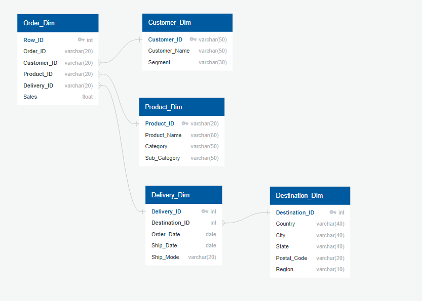

# Sales Data Analysis and Database Normalization Project

This project focuses on the normalization and analysis of a large sales database. The main objectives include database normalization to eliminate redundancies and improve data organization. Additionally, the project involves using MySQL to create a structured schema and conduct in-depth analysis of the sales data.


## Objectives

The primary objectives of this project are as follows:

1. **ERD Design**: An Entity-Relationship Diagram (ERD) will be designed using tools like [QuickDBD](https://app.quickdatabasediagrams.com/#/) to visualize the database's structure. This ERD provides a blueprint for the database schema, showcasing the relationships between entities.
2. **Database Normalization**: The first step involves normalizing the sales database. This process entails breaking down the data into smaller, related tables, eliminating data redundancies, and establishing appropriate relationships between tables. The goal is to create a well-structured schema that optimizes data storage and retrieval.
3. **Data Analysis**: With the normalized database in place, the project moves on to data analysis. We'll use MySQL queries and possibly other analysis techniques to extract meaningful insights from the sales data. This may include sales trends, customer behavior patterns, product performance analysis, and more.

### ERD Design
When there is extensive data management in sales, it is common for many data points to be repeated, such as sold products, regular customers, and preferred distributors. Therefore, proper data normalization is crucial to avoid excessive storage use due to redundant information. <br>
I will use this diagram, which includes one main table and four additional ones:



### Normalized database
Now let's take a look at the composition of the new normalized tables.<br>
First, we have the main table called **'orden_dim.csv'**:
- **Row_ID**: This is the primary key, unique for each row.
- **Order_ID**: The unique ID for each order.
- **Customer_ID**: This is the ID that links to the ```'customer_dim.csv'``` table and provides data for each customer.
- **Product_ID**: This is the ID that links to the ```'product_dim.csv'``` table and provides data for each product.
- **Delivery_ID**: This is the ID that links to the ```'delivery_dim.csv'``` table and provides specific data on where the deliveries are made.
- **Sales**: The quantitative value of the product sale.

Next, we have three tables that are directly related to the main one: **'customer_dim.csv'**, **'product_dim.csv'**, and **'delivery_dim.csv'**.<br>
Let’s start with **'customer_dim.csv'**, which contains:
- **Customer_ID**: The unique ID for each customer.
- **Customer_Name**: The customer's first and last name.
- **Segment**: The segment to which the customer belongs.

Next is **'product_dim.csv'**, which contains:
- **Product_ID**: The unique ID for each product.
- **Product_Name**: The full name of the product.
- **Category**: The selected category of the product.
- **Sub-category**: The sub-category of the product.

Almost finish, we have **'delivery_dim.csv'**, which includes:
- **Delivery_ID**: The unique ID for each delivery.
- **Order_Date**: The date on which the product was ordered.
- **Ship_Date**: The date on which the product is shipped.
- **Ship_Mode**: The shipping method specified by the customer.
- **Destination_ID**: The ID that links to the ```'destination_dim.csv'``` table and provides data for each destination.

Finally, the last table connected to 'delivery_dim.csv' is **'destination_dim.csv'**, which includes:
- **Destination_ID**: The unique ID for each destination.
- **Country**: The country to which the product is shipped.
- **State**: The state or province to which the product is shipped.
- **City**: The city to which the product is shipped.
- **Postal_Code**: The postal code of the delivery address.
- **Region**: The region of the delivery address.
<br><br>
Note: Normally, this more specific data would not be separated from the delivery or the customer, but since we do not have it, it is more likely that there will be repeated data, and this will be tested.

### Data analysis
Our main goal is to increase sales, and to achieve this, it is essential to understand and analyze a variety of key data that can provide valuable insights into sales performance and improvement opportunities.<br>
1. Sales Analysis:
    - Total sales
    - Sales over time
    - Sales by product
    - Sales by category
2. Sales Quantities Analysis:
    - Quantity of sales over time
    - Quantity of sales by country
    - Quantity of sales by category
3. Micellaneous Analysis:
    - Shipping methods
    - Market Segmentation